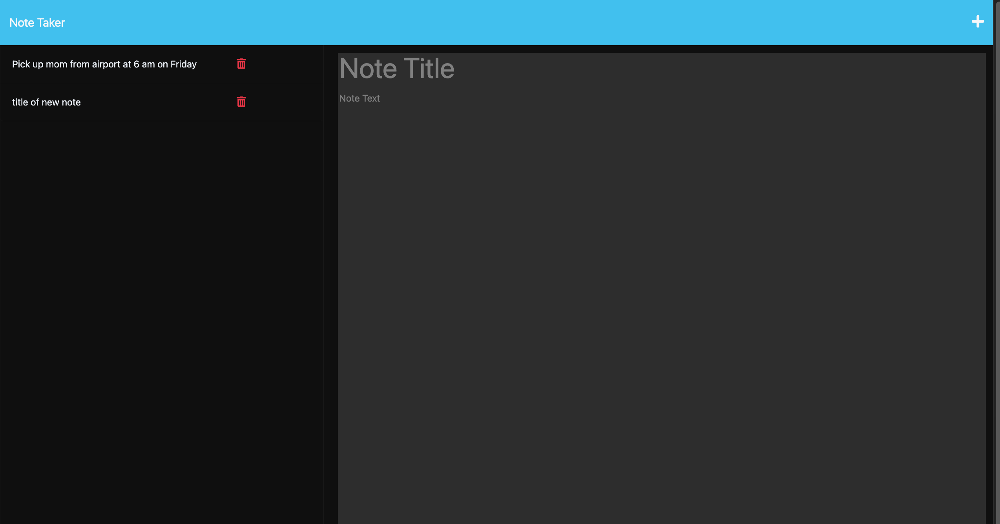

# NOTE TAKER
I am creating ana applciation Note Taker that can be used to write and save notes. This application will use an Express.js back end and will save and retrieve note data from a JSON file. 
Existing notes are listed in the left-hand column with empty fields on the right-hand side for the new note’s title and text.
## Mock-Up
The following images show the web application's appearance and functionality:

